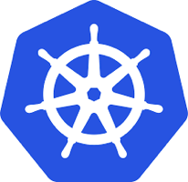
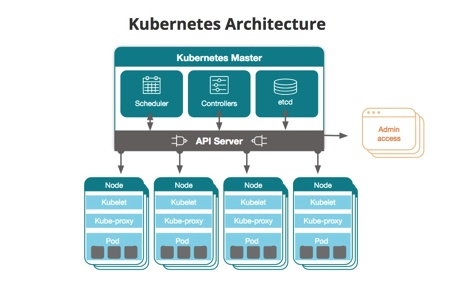
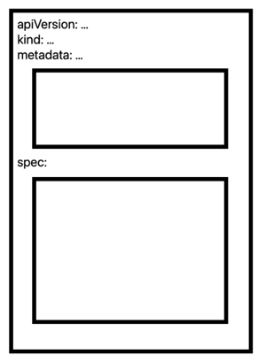
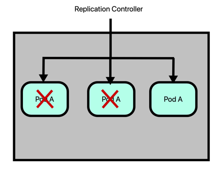
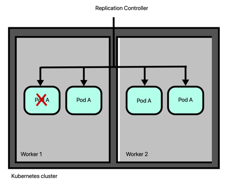
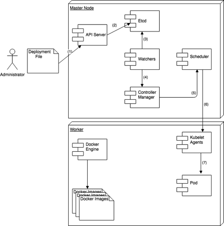
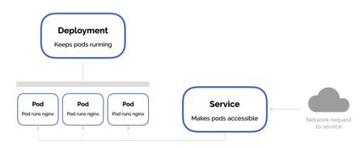
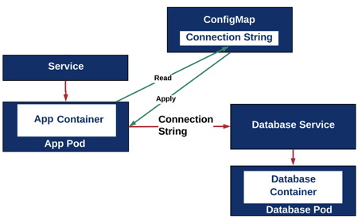
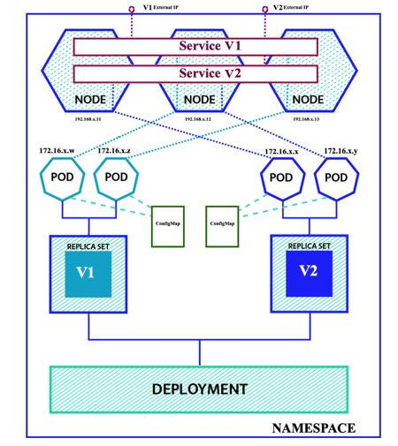

{:width="206" height="200" }

# Getting Started with Kubernetes

This is the first article of the **Getting Started with Kubernetes** article series. In this article, I would like to give you a brief introduction to Kubernetes. This will be the first step to show you how to deploy applications on it.

## What is Kubernetes?

According to the official website:

> *Kubernetes is an open-source system for automating deployment, scaling, and management of containerized applications. It groups containers that make up an application into logical units for easy management and discovery.*

Kubernetes helps you to deploy a containerized application on a cluster and manage its life cycle.

Manage the life cycle of a modern application is a big challenge for developers because it could be composed of several microservices deployed in a distributed way on a cluster. When the number of these micro-services grows the management would be cumbersome.

In this context orchestrator like Kubernetes become indispensable, because it makes sure those micro-services run where and when you want.

## Kubernetes Cluster Architecture

Kubernetes manages a cluster of computers that works as a single unit. It allows you to deploy applications without knowing anything about the machines. To make use of this new deployment model, *applications need to be containerized*.

### Kubernetes Components

Kubernetes has several components like:

* API Server;
* Etcd;
* Kubelet;
*  Kube-Proxy;
* Container runtime (i.e. Docker);
* Controller managers (i.e. replication controller, node controller, and so on);
* Scheduler.
* Understand where these components are located is essential to deploy Kubernetes correctly.

### Kubernetes Topology

A Kubernetes cluster consists of two types of nodes (minions):

1. A **Master node** that coordinates the cluster.
2. **Worker Nodes** where the application runs.

The following figure shows an example of Kubernetes topology and where its components are deployed. API Server, Etcd, Controllers, and Scheduler are on the Master node, while Kubelet, Kube-Proxy, and Container runtime are on the Worker nodes. It is possible to configure the Master node as a Worker node, in this case, Kubelet, Kube-Proxy, and Container runtime must be installed on it too.

{:width="450" height="285" }

*Photo from [https://blog.newrelic.com](https://blog.newrelic.com)*

### The Master Node

The main goal of the Master node is maintaining the application in the **desired state** and managing all the activities in your cluster, such as scheduling applications, scaling applications, and rolling out new updates. The desired state is the desired configuration required to run the application, it is stored in the **Etcd** component a key-value database. A master node can be a VM or a physical computer.

The **Controller Manager** runs multiple controllers. These controllers include:

* *Node Controller*: responsible for detecting and responding when nodes go down.
* *Replication Controller*: responsible for maintaining the correct number of pods for each application in the system.
* *Endpoints Controller*: populates the Endpoints object (that is, joins Services & Pods).
* *Service Account & Token Controllers*: create default accounts and API access tokens for new namespaces.

When you deploy applications on Kubernetes, you tell the master to start the application containers. The master schedules them to run on the cluster’s nodes. The Scheduler manages the scheduling operations.

The **API Server** component exposes Kubernetes API that both the administrator and nodes use to communicate with the master node.

### Nodes

A Node is a **worker** machine in Kubernetes and may be either a VM or a physical machine, depending on the cluster. Each Node is managed by the Master. A Node can have multiple pods, and the Kubernetes master automatically handles scheduling the pods across the Nodes in the cluster. The Master’s automatic scheduling takes into account the available resources on each Node.

Every Kubernetes Node runs at least:

* **Kubelet**, which is an agent for managing the node and communicating with the Kubernetes master. Kubelet agents communicate with the Controller Manager through the Kubernetes API.
* **A container runtime (like Docker)**, which is responsible for pulling the container image from a registry, unpacking the container, and running the application.
* **Kube-proxy**, a proxy that can do simple TCP, UDP, and SCTP stream forwarding or round-robin TCP, UDP, and SCTP forwarding across a set of backends.
* **Pods**, one or more Pods where the application lives. See the next paragraph for more details.

### Kubernetes Resources

In Kubernetes everything is a resource identified by a URL like this:

`/api/v1/namespaces/NAMESPACE/RESOURCE_TYPE/RESOURCE_NAME`

where RESOURCE_TYPE can be:

* nodes;
* pods;
* replication controllers or replica sets;
* deployments;
* services;
* etc.

we will analyze all these resources in the next sections. Kubernetes users can describe the desired state of these resources using a YAML  file.

### Kubernetes YAML file structure

For each Resource, the file contains a YAML code block that has essentially three elements:

* **metadata**, information like apiVersion, kind, labels, annotations, etc;
* **spec**, the desired state for the resource;
* **status**, the current status of the resource;

{:width="300" height="410" }

In every moment the goal of Kubernetes is to check the resource status, understand the differences from the desired state, in the case apply these differences. We will talk more about the desired state in the next sections.

The tag **apiVersion** describes the Kubernetes API version. There are resources like Pods that are available since v1, others like Deployment and ReplicaSet requires **apps/v1**. The tag **kind** describes the resource type: pods, deployment, replicaset, etc. The section **metadata** has information about the resource like, for example, its name. Finally, the **spec** section specifies the resource configuration, this vary from different resource types.

## Kubernetes Pods

### What is a Pod?

A **Pod** in Kubernetes is the smallest and atomic deployment unit. When you create a deployment, Kubernetes creates a Pod to host your application instance. A Pod is uniquely associated with an application. If you want a multi-instance application you need to replicate the Pod and deploy it on the same or other nodes. A Pod is a Kubernetes abstraction that represents a group of one or more application containers (such as Docker), and some shared resources for those containers.

Those resources include:

* Shared storage, as Volumes
* Networking, as a unique cluster IP address
* Information about how to run each container, such as the container image version or specific ports to use

A Pod is a “logical host” that contains different application containers that are relatively tightly coupled. For example, a Pod might include a container with the application as well as a helper container that feeds the data to be published by the application. The containers in a Pod share an IP Address, network,  port space, volumes, IPC and are always co-located and co-scheduled, and run in a shared context on the same Node.

{:width="450" height="191" }

*Photo from [https://dzone.com](https://dzone.com)*

### Why Pods?

**But why do we even need pods? Why can’t we use containers directly? Why would we even need to run multiple containers together? Can’t we put all our processes into a single container?**

Containers are designed to run only a single process (and dependencies) per container. If you run multiple unrelated processes in a single container, it is your responsibility to keep all those processes running, manage their logs, and so on.

Because you’re not supposed to group multiple processes into a single container, it’s obvious you need another higher-level construct that will allow you to bind containers together and manage them as a single unit. **This is the reasoning behind Pods**.

### Pod YAML definition

The following is an example of a YAML code block for Pod:


apiVersion: v1
kind: Pod
metadata:
    name: my-app-pod
spec:
    containers:
    - name: my-app-container
      image: nginx
      ports:
    - name: web
      image: myapp
      containerPort: 80
      protocol: TCP


Pod is available in Kubernetes API version v1, the kind is Pod and the metadata section contains its name. The spec section describes the Pod as a combination of two containers, one running nginx and another the app myapp.

Using the command:


kubect create -f pod.yml


you can create the Pod. To list the Pods in Kubernetes you can use the command:


kubect get pods


finally, to list information about the Pod you can use the command:


kubect describe pod my-app-pod


## Kubernetes Replication Controller vs ReplicaSet

### Kubernetes Replication Controller

Replication Controller in Kubernetes is responsible for mantaining the correct number of Pods for each application. By default, the number of Pod of an application is 1. If for some reason the Pod fails, the Replication Controller replaces it with a new one. However, there will be a small downtime.

{:width="450" height="314" }

To avoid the downtime and increase the availability of an application, user can replicates its code in multiple Pods managed by the Replication Controller. In this case, if a Pod goes down, its traffic is redirected to another one.

{:width="450" height="347" }

The number of Pods on a Node can increase until it reaches the node capacity. In this case, the Kubernetes administrator must add a new node to the cluster so that the Replication Controller can create other Pods on it.

{:width="450" height="361" }

The Replication Controller, in this case, will take care of the Pods on all the cluster nodes taking care of failover, scalability, and load balancing.

### Replication Controller YAML definition

TODO

### Kubernetes ReplicaSet

TODO

### Labels and Selectors

TODO

## Kubernetes Deployments

In a pre-orchestration world, installation scripts would often be used to deploy and start applications, but they did not manage the recovery from failure. In general, they did not help to keep the application in the desired state. Kubernetes uses a different approach to application management that helps to overcome this limitation.

### Deployment File and the Desired State

On a Kubernetes cluster, you can deploy your containerized applications specifying the desired state in a deployment YAML file. This file instructs Kubernetes on how to create and update instances of your application. With a deployment, it is as if you told Kubernetes that you want N instances of your Node.js app.

{:width="450" height="463" }

*Photo from [https://matthewpalmer.net](https://matthewpalmer.net)*

After the application instances creation, a Kubernetes Deployment Controller continuously monitors those instances. If the Node hosting an instance goes down, the Deployment Controller with a self-healing mechanism replaces it.

{:width="450" height="334" }

*Photo from [https://matthewpalmer.net](https://matthewpalmer.net)*

You can create and manage a Deployment by using the Kubernetes command-line interface, Kubectl. Kubectl uses the Kubernetes API to interact with the cluster.

### Deployment File Structure

A deployment YAML file has three sections:

* header
* spec
* spec.template

The **header** section reports information like the API version, the kind of YAML file (Deployment in our case) and the deployment name. The spec section that the number of replicas and the name and version of the application. The **spec.template** section, internally to the spec section, reports info about the Docker image to use, ports and other stuff.

{:width="450" height="254" }

*Photo from [https://matthewpalmer.net](https://matthewpalmer.net)*

### Behind the scenes

Here what happens behind the scene when you start a deployment.

{:width="450" height="453" }

1. Deployment starts
2. The desired state is stored in the Etcd component.
3. Watchers monitor Etcd to check desired state changes.
4. Watchers inform the Controller Manager that the desired state changed.
5. The Controller Manager schedules the deployment or updates via the Scheduler component.
6. The Scheduler contacts the Kublet agent of Workers involved to deploy the application.
7. A pod is created or updated with containers containing the application.

### Service

Suppose you decide to create an HTTP server cluster to manage request coming from thousands of browsers, you create a deployment file where you specify to run an Nginx application in 3 copies on 3 Pods. These Pods are accessible via the node IP. If a Pod on a node goes down and recreated on another node its IP change and the question is: **how can I reference that Pod?**

To make Pods accessible from external, Kubernetes uses a Service as a level of abstraction. A Service, basically, lives between clients and Pods and when an HTTP request arrives, it forwards the request to the right Pod.

{:width="450" height="184" }

This approach is useful for canary deployment as well, where you can deploy a new application version on separate Pods and make them accessible through a different Service only to a subset of users for test purposes.

## ConfigMap

To create 12-Factor applications it is essential that the application is separate from the configuration and data. It is possible to associate a configuration to a Pod using ConfigMap which is nothing more than a dictionary key value. If desired, you can create multiple configurations for development, test, and production environments.

{:width="450" height="276" }

The figure shows an application that uses a database as a service. The connection data to this database can change between development, test, and production environments. For this reason, it is possible to store this information externally in a ConfigMap.

The following is an example of a YAML code block for ConfigMap:


apiVersion: v1
kind: ConfigMap
metadata:
  name: db-config
  namespace: default
data:
  connection.properties: |
    db.name=mydb
    db.port=5432
    db.user=myuser
    db.password=mypassword


## Namespace

Kubernetes gives the possibility of having multiple virtual clusters that run on the same physical cluster. The platform uses namespaces as the artifact to separate the virtual clusters from each other. Kubernetes uses namespaces to group Kubernetes resources together using unique names.

The following is the YAML code to define a namespace:


apiVersion: v1
kind: Namespace
metadata:
    name: hello-k8s-ns


## Mix Everything together

In the beginning, digest all the Kubernetes concepts is not an easy task because it’s not clear the relationship between all of them. The following diagram shows the relationship between the resource types described so far.

{:width="450" height="505" }

The diagram shows a deployment composed of two versions of the same application both replicated in two Pods running each one on different nodes. Application configuration is outside the Pods in the ConfigMap and it is different for each version. Each Pod has its internal 172.16 IP not accessible outside the nodes and that could change over time. The Pods are accessible from external traffic via two Services, one for each version, that expose an external IP. In the diagram, the virtual cluster lives in its own namespace that separates it from other virtual clusters.

## Final Thoughts

This article is only an introduction to Kubernetes, its goal is to give you the basic knowledge of this technology. If you decide to package your application in Docker images and manage its life cycle with containers, Kubernetes can help you to orchestrate your application across a cluster of nodes keeping it in the desired state you specified in a deployment file.

However, to better learn the technology this article is not enough because it’s important to learn other Kubernetes important concepts like Cluster IP vs NodePort vs LoadBalancer vs Ingress. These items will be the subject of the next article.
